# Gates Research Database: Technical Design and Delivery Plan

**Status:** Proposed
**Scope:** Extend the existing Gates literature graph into a reviewed scientific and computational research database
**Repository:** `github.com/p1p3dream/adinkra-codespace`
**Initial vertical slice:** Four-color representations, permutahedra, and the hex selection-rule question
**Second vertical slice:** Eleven-dimensional Adynkra representation content and operator chains

## 1. Executive summary

The repository already contains a working literature graph. It has 295 Gates publication records, 166 local full texts, 10,153 page-anchored chunks, 1,131 distinct internal citation relationships, 2,694 external citation stubs, 3,407 nodes, and 4,827 edges. PostgreSQL, pgvector, full-text search, citation traversal, provenance, deterministic imports, and review states are already implemented.

The missing layer is not another document search system. It is a reviewed scientific record connecting:

```text
paper revision
  -> equation, table, definition, convention, or open question
  -> mathematical entity, representation, operator, claim, or assumption
  -> source file, Rust symbol, fixture, and command
  -> computation run and output artifact
  -> validation, discrepancy, limitation, and unresolved question
```

This design preserves the current corpus tables and adds typed scientific tables keyed to the existing node and edge graph. Large matrices, PDFs, source archives, and result files remain content-addressed files. PostgreSQL stores their identities, hashes, metadata, lineage, scientific meaning, and review status.

The first release should deeply curate the four-color to hex selection-rule chain. It must recover known issues and make them queryable:

1. The printed `VM_2` support discrepancy.
2. The left-versus-right-coset dependence of the 30-pair result.
3. The distinction between unsigned signability and closure under a stated Boolean-factor assignment.
4. Whether Gadget orthonormality is unique, rare, common, or merely conventional.
5. The complete provenance chain for each named representation and computed invariant.

Only after that pilot passes review and retrieval gates should the same model be extended to the eleven-dimensional level inventory and differential-complex program.

## 2. Background and problem statement

### 2.1 Current system

The live database already provides:

| Capability | Current implementation |
|---|---|
| Work identity | `gates_full_papers`, `gates_full_identifiers` |
| PDF and source artifacts | `gates_full_artifacts` |
| Page-anchored text | `gates_full_chunks` |
| Graph entities | `gates_full_nodes` |
| Graph relationships | `gates_full_edges` |
| Provenance | `gates_full_node_evidence`, `gates_full_edge_evidence` |
| Search | PostgreSQL full-text search plus 768-dimensional vector search |
| Traversal | Reviewed graph traversal with pending edges excluded by default |
| Import safety | Deterministic keys, upserts, checksums, dry-run default, no deletes |

The live `gates_full_papers` table has 2,989 rows because it contains the 295 corpus works plus 2,694 external citation stubs. This distinction must remain visible in every coverage view.

### 2.2 Current limitation

The graph is broad but scientifically shallow. Most accepted relationships are citation or authorship relationships. The full-corpus semantic pass contributes only one pending proposal per full-text paper. It does not yet model equations, table rows, conventions, assumptions, representation occurrences, operator maps, code symbols, runs, result artifacts, or limitations at sufficient depth.

Vector search already handles passage location well. The extension is justified only where structured, multi-hop reasoning adds value:

- source-to-code fidelity;
- assumption and convention tracking;
- dependency and impact analysis;
- discrepancy resolution;
- reproduction coverage;
- negative-result boundaries;
- mathematical inventory and missing-arrow queries;
- generation of reproducibility packets.

### 2.3 Design principle

The database records what a source states, what a computation tested, and what a reviewer accepted as three separate facts. It must never collapse them into a single truth flag.

## 3. Goals

1. Trace every load-bearing scientific statement to a paper revision, physical page, and printed equation, table, figure, or passage.
2. Trace every computational finding to a repository commit, source symbol, command, input hashes, output hash, and validation record.
3. Represent assumptions, conventions, equivalences, and limitations as first-class objects.
4. Make contradictions and unresolved source differences explicit rather than silently repairing fixtures.
5. Support the four-color selection-rule analysis and the eleven-dimensional representation/operator inventory with domain-specific analytic views.
6. Generate concise, source-backed answers and reproducibility packets for meetings and papers.
7. Preserve deterministic imports and the current review-state discipline.

## 4. Non-goals

1. Automatically infer new physics from unreviewed text extraction.
2. Treat citation as scientific dependence.
3. Store large dense matrices directly in PostgreSQL.
4. Parse every equation in all 166 full-text papers before proving value on a focused slice.
5. Declare an object physical solely because its one-dimensional Garden algebra closes.
6. Treat a published statement as verified merely because it was extracted correctly.
7. Replace the existing hybrid search and citation graph.
8. Acquire or redistribute copyrighted full texts without permission.

## 5. System architecture

```text
                    EXISTING LITERATURE LAYER
  manifest -> paper artifacts -> page chunks -> citations -> hybrid search
       |             |               |              |
       +-------------+---------------+--------------+
                                     |
                           reviewed source units
                                     |
                  SCIENTIFIC NORMALIZATION LAYER
        entities, claims, assumptions, conventions, representations,
            operators, invariants, complexes, discrepancies, questions
                                     |
                    COMPUTATIONAL PROVENANCE LAYER
        repositories -> commits -> software units -> runs -> artifacts
                                     |
                         validation and cross-checks
                                     |
                         ANALYTIC AND GRAPH LAYER
       traceability, coverage, impact, negative-result, selection-rule,
                eleven-dimensional, and reproducibility views
```

### 5.1 Storage policy

- PostgreSQL stores normalized metadata, relationships, review decisions, scalar invariant values, and searchable descriptions.
- pgvector stores embeddings for source units and reviewed scientific objects.
- The repository or object storage holds PDFs, TeX sources, matrices, images, HTML, JSON certificates, logs, and large datasets.
- Every external file referenced by the database requires SHA-256, byte count, media type, and a stable path or URI.
- Git commit SHA and file SHA are both recorded. A commit identifies context; a file hash identifies content.
- Generated graph relationships use the existing `gates_full_edges` table. Domain tables remain authoritative for structured attributes.

### 5.2 Import packages

Add the following packages under `research/gates_graphrag_full/`:

```text
source_units/       reviewed equations, tables, figures, definitions, passages
science/            normalized entities, claims, assumptions, conventions
computations/       repository, software, run, artifact, and validation manifests
domains/four_color/ selection-rule fixtures and reviewed mappings
domains/eleven_d/   levels, representations, operators, and complexes
analytics/          SQL views, refresh scripts, question sets, dashboard exports
```

Each package must have an input contract, validator, deterministic dry-run plan, importer, validation artifact, and review queue.

## 6. Identity and review conventions

### 6.1 Stable identifiers

Use readable deterministic keys:

```text
source:arxiv:2304.09830:v1:eq:2.17
source:arxiv:2408.09342:v1:table:5:row:VM2:L3
entity:group:S4/V4
representation:four-color:VM2:published-2408
claim:four-color:VM2-support-discrepancy
assumption:finite-local-auxiliaries
convention:coset-orientation:left
software:adinkra-codespace:src/permutahedron.rs:verify_garden
artifact:four-color:signed-recursion:v1
run:sha256:<canonical-run-manifest-hash>
validation:sha256:<canonical-validation-manifest-hash>
question:hex:boolean-factor-selection-rule
```

### 6.2 Review states

Reuse the existing states where applicable:

| State | Meaning |
|---|---|
| `observed` | Directly imported bibliographic or system fact |
| `pending` | Extracted or proposed, not yet accepted |
| `accepted` | Human-reviewed and accepted within its stated scope |
| `rejected` | Human-reviewed and rejected |

Computational outcomes use a separate controlled status:

| Outcome | Meaning |
|---|---|
| `pass` | The stated test passed |
| `fail` | The stated test failed |
| `incomplete` | Execution or evidence is incomplete |
| `not_applicable` | Test does not apply to this object |
| `unresolved` | Evidence conflicts or interpretation is unsettled |

### 6.3 Evidence classes

Every claim relationship records one of:

- `states`: a source states the claim;
- `supports`: evidence raises confidence in the claim;
- `refutes`: evidence conflicts with the claim;
- `reproduces`: a computation reproduces the stated result under recorded conventions;
- `does_not_test`: the artifact is relevant but outside the claim's scope;
- `qualifies`: a boundary narrows the claim;
- `supersedes`: a later reviewed record replaces an earlier one.

## 7. Database schema

### 7.1 Existing tables retained unchanged

The following tables remain authoritative and are not rebuilt:

```text
gates_full_schema_migrations
gates_full_corpora
gates_full_ingest_sources
gates_full_papers
gates_full_identifiers
gates_full_artifacts
gates_full_chunks
gates_full_nodes
gates_full_edges
gates_full_node_evidence
gates_full_edge_evidence
```

`gates_full_artifacts` continues to mean publication artifacts such as PDFs and source archives. Computational files use the distinct `gates_full_computational_artifacts` table.

### 7.2 Controlled relationship catalog

#### `gates_full_relationship_types`

Controls graph vocabulary and prevents improvised relationship names.

| Column | Type | Constraints or meaning |
|---|---|---|
| `relationship` | text | Primary key, uppercase verb phrase |
| `inverse_relationship` | text | Nullable self-reference |
| `description` | text | Operational definition |
| `allowed_source_types` | text[] | Permitted `gates_full_nodes.node_type` values |
| `allowed_target_types` | text[] | Permitted target types |
| `symmetric` | boolean | Default false |
| `transitive` | boolean | Default false; used only by approved closure views |
| `requires_evidence` | boolean | Default true |
| `active` | boolean | Allows deprecation without deletion |
| `properties` | jsonb | Version and domain notes |

Initial controlled relationships:

```text
CONTAINS, DEFINES, STATES, USES_CONVENTION, ASSUMES, DEPENDS_ON,
IMPLEMENTS, VERIFIES, EXECUTES, READS, PRODUCES, REPRODUCES,
SUPPORTS, REFUTES, DOES_NOT_TEST, CORROBORATES, COMPARES, DISPLAYS,
QUALIFIED_BY, HAS_REPRESENTATION, HAS_INVARIANT, EQUIVALENT_UNDER,
HAS_PARENT, RESOLVES, MOTIVATES, ANSWERS, SUPERSEDES, PART_OF_COMPLEX,
MAPS_FROM, MAPS_TO
```

Existing relationship names remain valid. A compatibility view identifies legacy relationships absent from this catalog.

### 7.3 Source layer

#### `gates_full_source_units`

One row per reviewed equation, equation range, table, table row, figure, definition, theorem, stated result, open question, convention, limitation, or material prose passage. Each row also has a matching node in `gates_full_nodes`.

| Column | Type | Constraints or meaning |
|---|---|---|
| `corpus_id` | text | Composite FK component |
| `node_id` | text | PK and FK to `gates_full_nodes` |
| `paper_id` | text | FK to corpus work |
| `artifact_id` | text | FK to the precise PDF or source revision |
| `unit_type` | text | Controlled type listed above |
| `printed_label` | text | Example: `Eq. (2.17)` |
| `normalized_label` | text | Stable machine label |
| `parent_source_unit_id` | text | Nullable source-unit hierarchy |
| `page_start` | integer | Physical PDF page |
| `page_end` | integer | Physical PDF page |
| `bbox` | jsonb | Optional page coordinates and coordinate system |
| `chunk_id` | text | Nullable FK to containing chunk |
| `verbatim_text` | text | Short reviewed source excerpt |
| `source_latex` | text | Reviewed source TeX when available |
| `normalized_math` | text | Optional normalized expression for matching, never source authority |
| `content_sha256` | text | Hash of canonical source-unit payload |
| `extraction_method` | text | PDF text, TeX source, manual, or mixed |
| `ocr_risk` | text | `none`, `low`, `medium`, `high` |
| `review_status` | text | Existing four-state vocabulary |
| `reviewed_by` | text | Nullable reviewer identity |
| `reviewed_at` | timestamptz | Nullable |
| `properties` | jsonb | Revision-specific details |

Required uniqueness:

```text
(corpus_id, artifact_id, normalized_label)
```

#### `gates_full_source_unit_links`

Records structural relations within a source revision without overloading scientific dependence.

| Column | Type | Meaning |
|---|---|---|
| `corpus_id` | text | Corpus key |
| `source_unit_id` | text | Source unit |
| `related_source_unit_id` | text | Related unit |
| `relation` | text | `follows`, `defines_symbol_for`, `derives_from`, `cites_equation`, `same_content_as`, `conflicts_with` |
| `review_status` | text | Review state |
| `properties` | jsonb | Notes and matching method |

Primary key: `(corpus_id, source_unit_id, related_source_unit_id, relation)`.

### 7.4 Scientific object layer

All typed objects below use `node_id` as their primary key and as a foreign key to `gates_full_nodes`. This provides graph traversal without duplicating identity.

#### `gates_full_scientific_entities`

General mathematical and physical objects that do not require a more specific table.

| Column | Type | Meaning |
|---|---|---|
| `corpus_id`, `node_id` | text | Composite PK and node FK |
| `entity_kind` | text | field, multiplet, group, coset, projector, matrix_set, equation_system, cohomology, dataset, other |
| `canonical_notation` | text | Preferred notation |
| `definition_source_unit_id` | text | Nullable reviewed definition |
| `scope` | text | Dimensional, algebraic, or physical scope |
| `review_status` | text | Review state |
| `properties` | jsonb | Structured domain attributes |

#### `gates_full_entity_aliases`

| Column | Type | Meaning |
|---|---|---|
| `corpus_id` | text | Corpus key |
| `node_id` | text | Entity node |
| `alias` | text | Alias as printed or used in code |
| `alias_type` | text | notation, former_name, code_name, spelling, paper_local |
| `source_unit_id` | text | Nullable provenance |
| `is_preferred` | boolean | Preferred within stated scope |
| `properties` | jsonb | Paper or domain restriction |

Primary key: `(corpus_id, node_id, alias, alias_type)`.

#### `gates_full_claims`

| Column | Type | Meaning |
|---|---|---|
| `corpus_id`, `node_id` | text | Composite PK and node FK |
| `claim_kind` | text | published_statement, computational_finding, inference, conjecture, negative_result, boundary |
| `statement` | text | Atomic claim |
| `origin_kind` | text | publication, computation, review, conversation |
| `status` | text | asserted, supported, reproduced, refuted, unresolved, superseded |
| `scope_text` | text | Conditions under which the statement applies |
| `source_unit_id` | text | Nullable source for published statement |
| `review_status` | text | Review state |
| `properties` | jsonb | Quantities, labels, or machine-readable scope |

Claims must be atomic enough that one piece of evidence can support or refute them without also changing an unrelated clause.

#### `gates_full_assumptions`

| Column | Type | Meaning |
|---|---|---|
| `corpus_id`, `node_id` | text | Composite PK and node FK |
| `assumption_kind` | text | locality, finiteness, valise, square_module, momentum, gauge, boundary_condition, inverse_derivative, equation_of_motion, representation, other |
| `statement` | text | Assumption in plain mathematical language |
| `parameterization` | jsonb | Example: momentum order or auxiliary count |
| `review_status` | text | Review state |

#### `gates_full_conventions`

| Column | Type | Meaning |
|---|---|---|
| `corpus_id`, `node_id` | text | Composite PK and node FK |
| `convention_kind` | text | coset_orientation, matrix_action, color_order, sign, normalization, index_order, metric_signature, Fourier, block_order, other |
| `domain` | text | Scope of the convention |
| `value_text` | text | Human-readable value |
| `value_json` | jsonb | Machine-readable value |
| `source_unit_id` | text | Nullable source definition |
| `review_status` | text | Review state |

#### `gates_full_open_questions`

| Column | Type | Meaning |
|---|---|---|
| `corpus_id`, `node_id` | text | Composite PK and node FK |
| `question` | text | Atomic research question |
| `origin_kind` | text | paper, conversation, repository, review |
| `source_unit_id` | text | Nullable source locator |
| `status` | text | open, bounded, in_progress, answered, blocked, retired |
| `priority` | integer | 1 highest |
| `tractability` | text | unknown, local, workstation, distributed, physics_input_required |
| `success_criterion` | text | Falsifiable completion gate |
| `review_status` | text | Review state |
| `properties` | jsonb | Owner, next action, estimates |

#### `gates_full_discrepancies`

| Column | Type | Meaning |
|---|---|---|
| `corpus_id`, `node_id` | text | Composite PK and node FK |
| `discrepancy_kind` | text | typo_candidate, convention_conflict, source_code_mismatch, cross_paper_conflict, reproduction_failure, unresolved_normalization |
| `summary` | text | Neutral statement of the difference |
| `status` | text | open, confirmed_typo, convention_difference, resolved, not_a_discrepancy |
| `severity` | text | informational, affects_fixture, affects_result, blocks_work |
| `resolution_text` | text | Nullable reviewed resolution |
| `resolved_by_source_unit_id` | text | Nullable authoritative source |
| `review_status` | text | Review state |
| `properties` | jsonb | Structured comparison |

#### `gates_full_discrepancy_items`

Allows two or more compared values.

| Column | Type | Meaning |
|---|---|---|
| `corpus_id` | text | Corpus key |
| `discrepancy_id` | text | Discrepancy node |
| `ordinal` | integer | Side order |
| `source_unit_id` | text | Nullable source side |
| `artifact_node_id` | text | Nullable computational side |
| `claim_node_id` | text | Nullable claim side |
| `value_text` | text | Compared value |
| `value_json` | jsonb | Structured value |
| `properties` | jsonb | Notes |

Exactly one of `source_unit_id`, `artifact_node_id`, or `claim_node_id` is required. Primary key: `(corpus_id, discrepancy_id, ordinal)`.

### 7.5 Representation, operator, invariant, and complex layer

#### `gates_full_representations`

| Column | Type | Meaning |
|---|---|---|
| `corpus_id`, `node_id` | text | Composite PK and node FK |
| `representation_kind` | text | Lorentz, SUSY, permutation, Garden, adinkra, field_content, other |
| `spacetime_dimension` | integer | Nullable |
| `supersymmetry_n` | integer | Nullable |
| `color_count` | integer | Nullable |
| `group_name` | text | Example: `SO(1,10)` |
| `dynkin_label` | text | Normalized label, nullable |
| `boson_count` | integer | Nullable |
| `fermion_count` | integer | Nullable |
| `is_valise` | boolean | Nullable |
| `parentage_status` | text | published, inferred, none_stated, unknown |
| `definition_source_unit_id` | text | Nullable |
| `review_status` | text | Review state |
| `properties` | jsonb | Quartet, support, code, chromotopology, rank, and other domain data |

#### `gates_full_representation_occurrences`

Records a representation appearing in a paper, superspace level, field, source, target, or complex term.

| Column | Type | Meaning |
|---|---|---|
| `corpus_id` | text | Corpus key |
| `occurrence_id` | text | Deterministic PK |
| `representation_node_id` | text | Representation |
| `container_node_id` | text | Paper, source unit, field, complex, or artifact node |
| `source_unit_id` | text | Nullable locator |
| `level` | integer | Nullable superspace level |
| `multiplicity` | integer | Default 1 |
| `parity` | text | bosonic, fermionic, mixed, unknown |
| `derivative_degree` | integer | Nullable |
| `role` | text | source, target, field, gauge_parameter, curvature, Bianchi, auxiliary, residual, other |
| `review_status` | text | Review state |
| `properties` | jsonb | Copy labels and decomposition context |

#### `gates_full_operators`

| Column | Type | Meaning |
|---|---|---|
| `corpus_id`, `node_id` | text | Composite PK and node FK |
| `operator_kind` | text | supersymmetry, gauge, differential, projector, intertwiner, Bianchi, Euler_Lagrange, matrix_action, other |
| `symbol` | text | Preferred notation |
| `derivative_order` | integer | Nullable |
| `linearity` | text | linear, affine, nonlinear, unknown |
| `coefficient_domain` | text | Z, Q, R, C, polynomial, Laurent, symbolic, other |
| `definition_source_unit_id` | text | Nullable |
| `review_status` | text | Review state |
| `properties` | jsonb | Gauge, momentum, parity, and normalization data |

#### `gates_full_operator_maps`

| Column | Type | Meaning |
|---|---|---|
| `corpus_id` | text | Corpus key |
| `map_id` | text | Deterministic PK |
| `operator_node_id` | text | Operator |
| `domain_node_id` | text | Domain representation or entity |
| `codomain_node_id` | text | Codomain representation or entity |
| `source_unit_id` | text | Nullable definition or use |
| `derivative_degree` | integer | Nullable |
| `multiplicity` | integer | Default 1 |
| `status` | text | published, constructed, verified, ruled_out, proposed, missing |
| `review_status` | text | Review state |
| `properties` | jsonb | Rank, kernel, image, copy labels, coefficients |

#### `gates_full_invariants`

| Column | Type | Meaning |
|---|---|---|
| `corpus_id`, `node_id` | text | Composite PK and node FK |
| `invariant_kind` | text | Garden, Gadget, HYMN, holoraumy, chi0, coset_family, rank, nullity, cohomology, other |
| `value_type` | text | boolean, integer, rational, real, text, vector, matrix, json |
| `definition_source_unit_id` | text | Nullable |
| `software_unit_node_id` | text | Nullable canonical implementation |
| `review_status` | text | Review state |
| `properties` | jsonb | Tolerance policy or algebraic domain |

#### `gates_full_invariant_observations`

| Column | Type | Meaning |
|---|---|---|
| `corpus_id` | text | Corpus key |
| `observation_id` | text | Deterministic PK |
| `subject_node_id` | text | Representation, candidate, run, or artifact |
| `invariant_node_id` | text | Invariant definition |
| `convention_node_id` | text | Nullable governing convention |
| `source_unit_id` | text | Nullable published value |
| `run_node_id` | text | Nullable computed value |
| `value_bool` | boolean | Nullable typed value |
| `value_integer` | bigint | Nullable typed value |
| `value_numeric` | numeric | Nullable typed value |
| `value_text` | text | Nullable typed value |
| `value_json` | jsonb | Nullable structured value |
| `outcome` | text | pass, fail, incomplete, unresolved, not_applicable |
| `review_status` | text | Review state |
| `properties` | jsonb | Tolerance, normalization, units |

Exactly one value column is populated unless `outcome` is `incomplete` or `unresolved`.

#### `gates_full_equivalence_actions`

| Column | Type | Meaning |
|---|---|---|
| `corpus_id`, `node_id` | text | Composite PK and node FK |
| `action_kind` | text | vertex_switch, color_permutation, supercharge_sign, block_swap, node_permutation, conjugation, left_right_conversion, other |
| `acting_group` | text | Nullable group name |
| `action_spec` | jsonb | Machine-readable action |
| `source_unit_id` | text | Nullable published definition |
| `review_status` | text | Review state |

Equivalence links use `gates_full_edges.relationship = 'EQUIVALENT_UNDER'` and identify the action node in edge properties.

#### `gates_full_differential_complexes`

| Column | Type | Meaning |
|---|---|---|
| `corpus_id`, `node_id` | text | Composite PK and node FK |
| `complex_kind` | text | gauge_curvature, superspace, cochain, resolution, other |
| `name` | text | Human-readable name |
| `dimension` | integer | Nullable spacetime dimension |
| `supersymmetry_n` | integer | Nullable |
| `status` | text | published, reconstructed, partial, proposed |
| `review_status` | text | Review state |
| `properties` | jsonb | Cohomological and convention data |

#### `gates_full_complex_terms`

| Column | Type | Meaning |
|---|---|---|
| `corpus_id` | text | Corpus key |
| `complex_node_id` | text | Complex |
| `position` | integer | Ordered degree |
| `term_node_id` | text | Representation or scientific entity |
| `role` | text | gauge_parameter, prepotential, field_strength, Bianchi, Euler_Lagrange, other |
| `source_unit_id` | text | Nullable |
| `review_status` | text | Review state |

Primary key: `(corpus_id, complex_node_id, position, term_node_id)`.

#### `gates_full_complex_arrows`

| Column | Type | Meaning |
|---|---|---|
| `corpus_id` | text | Corpus key |
| `complex_node_id` | text | Complex |
| `ordinal` | integer | Arrow order |
| `operator_node_id` | text | Operator |
| `from_position` | integer | Source term position |
| `to_position` | integer | Target term position |
| `composition_status` | text | unknown, zero, nonzero, conditional, not_tested |
| `kernel_status` | text | unknown, computed, partial |
| `image_status` | text | unknown, computed, partial |
| `source_unit_id` | text | Nullable |
| `review_status` | text | Review state |
| `properties` | jsonb | Rank and cohomology results |

Primary key: `(corpus_id, complex_node_id, ordinal)`.

### 7.6 Computational provenance layer

#### `gates_full_repositories`

| Column | Type | Meaning |
|---|---|---|
| `repository_id` | text | Primary key |
| `canonical_url` | text | Unique repository URL |
| `default_branch` | text | Informational |
| `properties` | jsonb | Hosting and access notes |

#### `gates_full_commits`

| Column | Type | Meaning |
|---|---|---|
| `repository_id` | text | Repository FK |
| `commit_sha` | text | Full commit SHA |
| `tree_sha` | text | Nullable |
| `committed_at` | timestamptz | Nullable |
| `subject` | text | Commit subject |
| `properties` | jsonb | Branch label is informational only |

Primary key: `(repository_id, commit_sha)`.

#### `gates_full_software_units`

One version-specific row per module, function, command, test, generator, importer, notebook, or visualization entry point. Each row has a graph node.

| Column | Type | Meaning |
|---|---|---|
| `corpus_id`, `node_id` | text | Composite PK and node FK |
| `repository_id` | text | Repository FK |
| `commit_sha` | text | Commit FK |
| `unit_type` | text | module, function, test, binary, subcommand, script, visualization |
| `language` | text | Rust, SQL, Python, JavaScript, shell, other |
| `path` | text | Repository-relative path |
| `symbol` | text | Nullable symbol or test name |
| `content_sha256` | text | File or normalized unit hash |
| `cargo_package` | text | Nullable |
| `review_status` | text | Review state |
| `properties` | jsonb | Feature flags and compilation target |

#### `gates_full_computational_artifacts`

| Column | Type | Meaning |
|---|---|---|
| `corpus_id`, `node_id` | text | Composite PK and node FK |
| `artifact_type` | text | fixture, matrix_set, dataset, certificate, report, log, image, html, archive, binary |
| `schema_version` | text | Nullable artifact schema |
| `path_or_uri` | text | Stable local path or object URI |
| `sha256` | text | Required content hash |
| `byte_count` | bigint | Required |
| `media_type` | text | Required |
| `canonical` | boolean | Preferred artifact for its logical key |
| `boundary_text` | text | What the artifact does not establish |
| `review_status` | text | Review state |
| `properties` | jsonb | Counts, dimensions, checksum families |

Unique key: `(corpus_id, sha256)`.

#### `gates_full_computation_runs`

| Column | Type | Meaning |
|---|---|---|
| `corpus_id`, `node_id` | text | Composite PK and node FK |
| `repository_id` | text | Repository FK |
| `commit_sha` | text | Commit FK |
| `command` | text | Reproduction command without secrets |
| `working_directory` | text | Repository-relative path |
| `cargo_lock_sha256` | text | Nullable but required for Rust release claims |
| `toolchain` | jsonb | Compiler and dependency versions |
| `machine_profile` | jsonb | CPU, RAM, OS; no credentials or host secrets |
| `started_at` | timestamptz | Nullable |
| `finished_at` | timestamptz | Nullable |
| `wall_seconds` | numeric | Nullable |
| `status` | text | queued, running, completed, failed, interrupted |
| `exit_code` | integer | Nullable |
| `determinism` | text | deterministic, seeded, numerical, unknown |
| `properties` | jsonb | Threads, shard, seed, peak memory |

#### `gates_full_run_io`

| Column | Type | Meaning |
|---|---|---|
| `corpus_id` | text | Corpus key |
| `run_node_id` | text | Run |
| `artifact_node_id` | text | Computational artifact |
| `direction` | text | input or output |
| `role` | text | fixture, source, config, certificate, log, checkpoint, visualization, other |
| `ordinal` | integer | Stable ordering |
| `properties` | jsonb | Shard ranges and optionality |

Primary key: `(corpus_id, run_node_id, direction, role, ordinal)`.

#### `gates_full_run_software`

| Column | Type | Meaning |
|---|---|---|
| `corpus_id` | text | Corpus key |
| `run_node_id` | text | Run |
| `software_unit_node_id` | text | Executed or loaded unit |
| `role` | text | entrypoint, verifier, generator, library, crosscheck |
| `properties` | jsonb | Build flags |

Primary key: `(corpus_id, run_node_id, software_unit_node_id, role)`.

#### `gates_full_validations`

| Column | Type | Meaning |
|---|---|---|
| `corpus_id`, `node_id` | text | Composite PK and node FK |
| `validation_kind` | text | source_audit, algebraic_identity, independent_encoding, checksum, schema, count, performance, visual, manual |
| `subject_node_id` | text | Claim, run, artifact, source unit, or software unit |
| `validator_software_unit_id` | text | Nullable |
| `validation_run_node_id` | text | Nullable |
| `outcome` | text | pass, fail, incomplete, unresolved, not_applicable |
| `exactness` | text | integer_exact, rational_exact, symbolic, numerical_tolerance, manual, structural |
| `tolerance` | jsonb | Required for numerical tests |
| `summary` | text | Atomic result |
| `review_status` | text | Review state |
| `properties` | jsonb | Counts and diagnostic details |

### 7.7 Review and annotation layer

#### `gates_full_reviews`

Provides an append-only audit trail. The current status remains on the reviewed row for efficient filtering.

| Column | Type | Meaning |
|---|---|---|
| `corpus_id` | text | Corpus key |
| `review_id` | text | Deterministic or UUID PK |
| `target_kind` | text | node, edge, source_unit, observation, operator_map, occurrence, complex_arrow |
| `target_id` | text | Target identifier |
| `decision` | text | accepted, rejected, needs_revision |
| `reviewer` | text | Reviewer identity |
| `reviewed_at` | timestamptz | Decision time |
| `comment` | text | Reason |
| `evidence_artifact_node_id` | text | Nullable review packet |
| `properties` | jsonb | Checklist version |

No importer may overwrite an accepted or rejected decision with pending data. Corrections append a new review event and update the target row in one transaction.

#### `gates_full_question_experiments`

Links open questions to computations designed to answer them.

| Column | Type | Meaning |
|---|---|---|
| `corpus_id` | text | Corpus key |
| `question_node_id` | text | Open question |
| `run_node_id` | text | Computation run |
| `role` | text | reproduction, discriminator, falsification, coverage, performance |
| `interpretation` | text | Reviewed statement of what the run means for the question |
| `review_status` | text | Review state |
| `properties` | jsonb | Planned or observed metric |

Primary key: `(corpus_id, question_node_id, run_node_id, role)`.

### 7.8 Conceptual entity-relationship map

```mermaid
erDiagram
    GATES_FULL_PAPERS ||--o{ GATES_FULL_ARTIFACTS : has_revision
    GATES_FULL_PAPERS ||--o{ GATES_FULL_CHUNKS : has_text
    GATES_FULL_ARTIFACTS ||--o{ GATES_FULL_SOURCE_UNITS : contains
    GATES_FULL_CHUNKS o|--o{ GATES_FULL_SOURCE_UNITS : anchors
    GATES_FULL_NODES ||--o| GATES_FULL_SOURCE_UNITS : types
    GATES_FULL_NODES ||--o| GATES_FULL_CLAIMS : types
    GATES_FULL_NODES ||--o| GATES_FULL_ASSUMPTIONS : types
    GATES_FULL_NODES ||--o| GATES_FULL_CONVENTIONS : types
    GATES_FULL_NODES ||--o| GATES_FULL_REPRESENTATIONS : types
    GATES_FULL_NODES ||--o| GATES_FULL_OPERATORS : types
    GATES_FULL_NODES ||--o| GATES_FULL_INVARIANTS : types
    GATES_FULL_NODES ||--o| GATES_FULL_SOFTWARE_UNITS : types
    GATES_FULL_NODES ||--o| GATES_FULL_COMPUTATIONAL_ARTIFACTS : types
    GATES_FULL_NODES ||--o| GATES_FULL_COMPUTATION_RUNS : types
    GATES_FULL_NODES ||--o| GATES_FULL_VALIDATIONS : types
    GATES_FULL_NODES ||--o{ GATES_FULL_EDGES : source
    GATES_FULL_NODES ||--o{ GATES_FULL_EDGES : target
    GATES_FULL_REPRESENTATIONS ||--o{ GATES_FULL_REPRESENTATION_OCCURRENCES : appears_as
    GATES_FULL_OPERATORS ||--o{ GATES_FULL_OPERATOR_MAPS : defines_map
    GATES_FULL_INVARIANTS ||--o{ GATES_FULL_INVARIANT_OBSERVATIONS : measures
    GATES_FULL_REPOSITORIES ||--o{ GATES_FULL_COMMITS : contains
    GATES_FULL_COMMITS ||--o{ GATES_FULL_SOFTWARE_UNITS : versions
    GATES_FULL_COMMITS ||--o{ GATES_FULL_COMPUTATION_RUNS : contextualizes
    GATES_FULL_COMPUTATION_RUNS ||--o{ GATES_FULL_RUN_IO : reads_or_produces
    GATES_FULL_COMPUTATIONAL_ARTIFACTS ||--o{ GATES_FULL_RUN_IO : participates
    GATES_FULL_COMPUTATION_RUNS ||--o{ GATES_FULL_RUN_SOFTWARE : executes
    GATES_FULL_SOFTWARE_UNITS ||--o{ GATES_FULL_RUN_SOFTWARE : participates
    GATES_FULL_DIFFERENTIAL_COMPLEXES ||--o{ GATES_FULL_COMPLEX_TERMS : contains
    GATES_FULL_DIFFERENTIAL_COMPLEXES ||--o{ GATES_FULL_COMPLEX_ARROWS : contains
    GATES_FULL_DISCREPANCIES ||--o{ GATES_FULL_DISCREPANCY_ITEMS : compares
    GATES_FULL_OPEN_QUESTIONS ||--o{ GATES_FULL_QUESTION_EXPERIMENTS : tested_by
```



The diagram omits composite `corpus_id` keys for readability. Every corpus-scoped foreign key includes `corpus_id`.

## 8. Input manifest schemas

Each importer consumes versioned JSONL. Unknown fields are rejected unless the schema explicitly permits them inside `properties`. Every row uses UTF-8, canonical JSON for hashing, and no NUL characters.

### 8.1 Common envelope

Every record contains:

| Field | Required | Meaning |
|---|---:|---|
| `schema_version` | yes | Contract identifier |
| `corpus_id` | yes | Existing corpus |
| `record_id` | yes | Deterministic identity |
| `record_type` | yes | Contract-specific type |
| `properties` | yes | JSON object, empty allowed |
| `provenance` | yes | Producing file, line, method, and source hash |

### 8.2 `gates-source-unit-v1`

Required payload:

```text
paper_id, artifact_id, unit_type, normalized_label, page_start,
page_end, content_sha256, extraction_method, ocr_risk, review_status
```

Conditional requirements:

- `printed_label` for equations, tables, figures, definitions, and theorems;
- `verbatim_text` or `source_latex` for every unit;
- `chunk_id` when the unit came from extracted PDF text;
- `reviewed_by` and `reviewed_at` when status is accepted or rejected.

### 8.3 `gates-scientific-object-v1`

Supports `entity`, `claim`, `assumption`, `convention`, `open_question`, `discrepancy`, `representation`, `operator`, `invariant`, `equivalence_action`, and `differential_complex` records.

Required payload:

```text
node_id, canonical_key, name, object_kind, review_status, typed_attributes
```

`typed_attributes` must validate against the corresponding table contract in Section 7. No record may use `properties` to bypass a required typed column.

### 8.4 `gates-scientific-link-v1`

Required payload:

```text
edge_id, source_node_id, relationship, target_node_id, basis,
review_status, evidence
```

`evidence` requires a source unit, computational artifact, validation, or manual review record. The relationship catalog validates permitted source and target types.

### 8.5 `gates-computational-artifact-v1`

Required payload:

```text
node_id, artifact_type, path_or_uri, sha256, byte_count, media_type,
review_status, boundary_text
```

`schema_version` is required when the file itself has a structured schema. A missing file, hash mismatch, or byte-count mismatch stops the import.

### 8.6 `gates-computation-run-v1`

Required payload:

```text
node_id, repository_id, commit_sha, command, working_directory,
toolchain, machine_profile, status, determinism, inputs, outputs,
software_units
```

Completed runs also require `finished_at`, `wall_seconds`, `exit_code`, and at least one output. Failed or interrupted runs retain logs and checkpoints when present.

### 8.7 `gates-validation-v1`

Required payload:

```text
node_id, validation_kind, subject_node_id, outcome, exactness,
summary, review_status
```

Numerical validations require `tolerance`. Source audits require one or more accepted source-unit locators. Independent encodings require a declared independence profile.

### 8.8 `gates-representation-occurrence-v1`

Required payload:

```text
occurrence_id, representation_node_id, container_node_id, multiplicity,
parity, role, review_status
```

`level`, `derivative_degree`, `copy_label`, and `source_unit_id` are conditionally required for the eleven-dimensional level inventory.

### 8.9 `gates-operator-map-v1`

Required payload:

```text
map_id, operator_node_id, domain_node_id, codomain_node_id,
multiplicity, status, review_status
```

Constructed or verified maps require a software implementation or computational artifact link. Published maps require a source unit.

### 8.10 `gates-invariant-observation-v1`

Required payload:

```text
observation_id, subject_node_id, invariant_node_id, outcome,
review_status
```

It requires one typed value unless unresolved or incomplete. A computed value requires `run_node_id`; a published value requires `source_unit_id`. Convention-sensitive invariants require `convention_node_id`.

### 8.11 `gates-discrepancy-v1`

Required payload:

```text
node_id, discrepancy_kind, summary, status, severity, items,
review_status
```

At least two items are required. Each item identifies one source unit, artifact, or claim and preserves its original value.

### 8.12 `gates-review-v1`

Required payload:

```text
review_id, target_kind, target_id, decision, reviewer, reviewed_at,
comment
```

Reviews are append-only. Import order cannot erase earlier review history.

## 9. Graph projection rules

The relational tables above supply structured facts. The graph projection supplies traversal. Importers create or update the following edges only after their typed rows validate:

| Source | Relationship | Target | Authority |
|---|---|---|---|
| paper | `CONTAINS` | source unit | source-unit table |
| source unit | `DEFINES` | entity, representation, operator, invariant | reviewed extraction |
| source unit | `STATES` | claim | reviewed extraction |
| claim | `ASSUMES` | assumption | reviewed scope analysis |
| source unit, claim, operator | `USES_CONVENTION` | convention | reviewed mapping |
| software unit | `IMPLEMENTS` | source unit or operator | source audit |
| run | `EXECUTES` | software unit | run manifest |
| run | `READS` | artifact | run I/O |
| run | `PRODUCES` | artifact | run I/O |
| artifact or validation | `SUPPORTS`, `REFUTES`, `REPRODUCES`, `DOES_NOT_TEST` | claim | reviewed interpretation |
| validation | `VERIFIES` | run, artifact, source unit, software unit | validation table |
| discrepancy | `COMPARES` | source unit, artifact, or claim | discrepancy items |
| visualization | `DISPLAYS` | artifact or representation | reviewed mapping |
| operator | `MAPS_FROM`, `MAPS_TO` | representation or entity | operator map |
| object | `PART_OF_COMPLEX` | differential complex | complex tables |

Graph edges never replace typed attributes. They are deterministic projections or separately reviewed scientific links.

## 10. Analytic views

### 10.1 Core provenance and governance views

#### `gates_full_v_source_unit_traceability`

- **Grain:** one source unit.
- **Joins:** paper, artifact revision, chunk, source unit, node evidence, review.
- **Columns:** paper identifier, title, revision hash, printed label, page, excerpt, TeX, OCR risk, review status.
- **Use:** primary-source spot checks and citation-ready exports.

#### `gates_full_v_relationship_contract_violations`

- **Grain:** one invalid or uncatalogued graph edge.
- **Checks:** missing relationship type, disallowed source/target type, missing required evidence, invalid review state.
- **Use:** migration gate and terminology control.

#### `gates_full_v_pending_review_queue`

- **Grain:** one pending node, edge, source unit, observation, map, occurrence, or discrepancy.
- **Columns:** target type, priority, evidence completeness, affected claims, affected artifacts.
- **Use:** reviewer work queue.

#### `gates_full_v_paper_research_coverage`

- **Grain:** one corpus paper, excluding external stubs by default.
- **Measures:** full-text status, source-unit counts by type, reviewed claims, conventions, implementations, reproductions, unresolved discrepancies.
- **Use:** prevent 2,989 paper rows from being mistaken for 2,989 locally held works.

#### `gates_full_v_unanchored_scientific_objects`

- **Grain:** one scientific node without an accepted source unit or accepted computational provenance path.
- **Use:** prevent attractive but unsupported graph nodes.

#### `gates_full_v_legacy_relationships`

- **Grain:** one existing relationship not yet represented in the controlled catalog.
- **Use:** compatibility migration without breaking the current graph.

### 10.2 Claim, assumption, and convention views

#### `gates_full_v_claim_evidence_status`

- **Grain:** one claim.
- **Measures:** number of stating sources, supporting artifacts, reproductions, refutations, qualifications, and unresolved discrepancies.
- **Derived status:** never upgrades automatically beyond rules approved for the claim kind.
- **Use:** safe summaries.

#### `gates_full_v_claim_assumption_matrix`

- **Grain:** one claim by one assumption.
- **Columns:** assumption kind, parameterization, source, test coverage, retained/open status.
- **Use:** answer which loopholes were tested and under what restrictions.

#### `gates_full_v_negative_result_boundaries`

- **Grain:** one negative-result claim.
- **Columns:** locality, finite auxiliaries, valise, square/rectangular, momentum regime, gauge treatment, inverse derivatives, boundary conditions, equations of motion, tested sizes.
- **Use:** prevent a bounded no-result from being reported as a universal no-go.

#### `gates_full_v_convention_dependencies`

- **Grain:** one claim, run, artifact, or invariant observation by convention.
- **Use:** identify results that change under left/right cosets, block order, sign, index, or normalization choices.

#### `gates_full_v_convention_conflicts`

- **Grain:** one logical object with two accepted incompatible convention values in overlapping scope.
- **Use:** surface ambiguity before computation.

#### `gates_full_v_discrepancy_register`

- **Grain:** one discrepancy.
- **Columns:** compared sides, values, affected fixtures, affected claims, severity, status, proposed resolution, reviewer.
- **Use:** meeting questions and correction tracking.

#### `gates_full_v_open_questions_compute_readiness`

- **Grain:** one open question.
- **Measures:** source clarity, convention completeness, available fixtures, implementation coverage, validation coverage, estimated compute class, missing physics input.
- **Use:** choose the next defensible computation.

### 10.3 Computational provenance and reproducibility views

#### `gates_full_v_artifact_lineage`

- **Grain:** one computational artifact.
- **Joins:** producing run, commit, software units, input artifacts, validations, supported claims, displayed visualizations.
- **Use:** complete provenance chain.

#### `gates_full_v_run_reproducibility`

- **Grain:** one run.
- **Checks:** commit present, lock hash present, command present, all inputs hashed, outputs hashed, machine profile present, exit status, validator outcome.
- **Use:** release gate for computational claims.

#### `gates_full_v_reproduction_coverage`

- **Grain:** one reviewed source unit that states a result.
- **Status:** not implemented, implemented, run, reproduced, discrepant, or outside scope.
- **Use:** identify published tables and equations not yet checked.

#### `gates_full_v_unimplemented_source_units`

- **Grain:** one accepted equation, table row, or algorithm source unit without an implementing software edge.
- **Use:** bounded engineering backlog.

#### `gates_full_v_unaudited_software_units`

- **Grain:** one software unit used in a result but lacking an accepted `IMPLEMENTS` link to a reviewed source unit or operator.
- **Use:** transcription audit queue.

#### `gates_full_v_validation_matrix`

- **Grain:** one artifact or claim by validation kind.
- **Columns:** source audit, algebraic identity, independent encoding, checksum, schema, count, performance, visual/manual status.
- **Use:** distinguish internal consistency from primary-source fidelity.

#### `gates_full_v_crosscheck_independence`

- **Grain:** one pair of validations on the same subject.
- **Measures:** distinct software paths, languages, fixtures, source transcriptions, arithmetic domains, and authorship.
- **Use:** detect nominally independent checks that share the same input error.

#### `gates_full_v_reproducibility_packet`

- **Grain:** one claim.
- **Output:** source locators, excerpts, conventions, assumptions, code commit, symbols, command, inputs, outputs, checksums, validations, discrepancies, and boundary text.
- **Use:** paper appendix, reviewer packet, or meeting handoff.

#### `gates_full_v_impact_analysis`

- **Grain:** one changed source unit, convention, software unit, or input artifact by affected downstream object.
- **Method:** dependency closure materialization.
- **Use:** determine what must be regenerated after a correction.

### 10.4 Differential-complex and equation-program views

#### `gates_full_v_equation_operator_chain`

- **Grain:** one differential complex position and arrow.
- **Columns:** gauge parameter, prepotential, field strength, Bianchi object, Euler-Lagrange object, representations, derivative orders, source equations, implementations, composition status.
- **Use:** map the route toward an equation without claiming the equation has been found.

#### `gates_full_v_complex_exactness_status`

- **Grain:** one adjacent arrow pair.
- **Measures:** whether composition was tested, whether it vanishes, known kernel, known image, quotient status, cohomology status, assumptions.
- **Use:** identify missing mathematical work.

#### `gates_full_v_missing_operator_arrows`

- **Grain:** one expected but absent operator map inferred from a reviewed complex specification.
- **Use:** generate finite intertwiner, kernel, or image tasks.

#### `gates_full_v_operator_source_code_fidelity`

- **Grain:** one operator map.
- **Columns:** printed source, normalized operator, implementing symbol, source-audit validation, coefficient domain, convention set.
- **Use:** prevent an operator calculation from drifting from the paper.

### 10.5 Four-color and hex analytic views

#### `gates_full_v_four_color_named_representations`

- **Grain:** one named representation.
- **Columns:** chiral/vector/tensor or mathematical-only parentage, quartet support, printed Boolean factors, corrected fixture, source rows, Garden status, Gadget, HYMN, holoraumy, chi0, and review state.

#### `gates_full_v_vm2_source_audit`

- **Grain:** one `VM_2` support value by source or artifact.
- **Expected recovery:** `3412` in arXiv:2408.09342, `3421` in arXiv:2304.09830, coset membership, Garden feasibility, and resolution state.

#### `gates_full_v_signed_candidate_feature_matrix`

- **Grain:** one inequivalent Garden-closing signed candidate.
- **Columns:** support, Boolean-factor class, vertex-switching class, color permutation class, supercharge-sign class, block-swap class, left family, right family, relative `S4/V4` class, HYMN, Gadget self-value, holoraumy, chi0, parentage, named-system match.
- **Use:** training-free classification and selector testing.

#### `gates_full_v_ordered_pair_recursion_results`

- **Grain:** one ordered pair under one convention set.
- **Columns:** input pair, block order, recursion equations, four-bit flips, output octet, Garden closure, left family, right family, swap-equivalent pair, source provenance.
- **Use:** state the 30-pair result without hiding convention dependence.

#### `gates_full_v_gadget_pairwise`

- **Grain:** one ordered pair of inequivalent closing candidates.
- **Columns:** Gadget value, normalization convention, run, validation, parentage labels.
- **Use:** build orthogonality graphs without loading matrices into PostgreSQL.

#### `gates_full_v_gadget_orthonormal_frames`

- **Grain:** one six-element frame.
- **Columns:** member IDs, diagonal values, maximum off-diagonal magnitude, equivalence-class orbit, contains published frame, contains physical-parent subset, HYMN pattern.
- **Use:** determine whether the published frame is unique, rare, common, or conventional.

#### `gates_full_v_selection_rule_predictions`

- **Grain:** one candidate selector by one named system.
- **Columns:** predicted positive, published closing status, true/false positive, true/false negative, fit-versus-holdout flag.
- **Positive controls:** `O`, `CV`, and `CT`, with `O` kept separate from the 51 composite branches when appropriate.
- **Use:** require predictive power rather than descriptive coincidence.

#### `gates_full_v_selector_performance`

- **Grain:** one selector definition.
- **Measures:** precision, recall, specificity, ambiguity count, number of selected equivalence classes, stability under allowed equivalences.
- **Use:** compare Gadget orthonormality, HYMN, coset family, abnormality, and combined rules.

#### `gates_full_v_hex_transfer_inventory`

- **Grain:** one four-color concept or operation.
- **Columns:** four-color definition, required 24-color analogue, known implementation, computational scale, missing convention, validation status.
- **Use:** state what transfers to the hex and what remains undefined.

### 10.6 Eleven-dimensional analytic views

#### `gates_full_v_11d_level_inventory`

- **Grain:** one superspace level by Dynkin label, parity, derivative degree, and copy.
- **Columns:** multiplicity, source equation/table, proposed role, implemented artifact, validation, gauge status.
- **Use:** the primary 32-level representation inventory.

#### `gates_full_v_11d_repeated_irreps`

- **Grain:** one level and Dynkin label with multiplicity greater than one.
- **Columns:** copy identifiers, known intertwiners, basis conventions, source and target uses.
- **Use:** identify mixing and copy-resolution work.

#### `gates_full_v_11d_intertwiner_coverage`

- **Grain:** one allowed source-target representation pair.
- **Columns:** abstract multiplicity, constructed copies, verified copies, coefficient domain, exact/numerical status, missing copies, source citation.
- **Use:** generate the next finite representation-theory tasks.

#### `gates_full_v_11d_gauge_image_kernel`

- **Grain:** one operator map at one momentum or derivative regime.
- **Columns:** domain, codomain, rank, nullity, kernel basis artifact, image basis artifact, zero-mode treatment, gauge-for-gauge status.
- **Use:** prevent zero-momentum and generic-momentum results from being conflated.

#### `gates_full_v_11d_coupling_gate_status`

- **Grain:** one proposed bridge or correction.
- **Columns:** source representation, target hook, level, derivative order, constructed coefficient artifact, exterior derivative result, cancellation outcome, assumptions, boundary.
- **Use:** summarize completed positive and negative coupling gates.

#### `gates_full_v_11d_missing_complex_arrows`

- **Grain:** one missing gauge, curvature, Bianchi, or Euler-Lagrange arrow.
- **Columns:** representation compatibility, known multiplicity, source availability, implementation availability, physics-input requirement.
- **Use:** distinguish compute-ready gaps from gaps requiring new constraint choices.

#### `gates_full_v_11d_claim_boundary_audit`

- **Grain:** one eleven-dimensional claim.
- **Checks:** abstract versus embedded coupling, numerical versus integer/rational verification, zero momentum versus polynomial momentum, gauge quotient supplied or absent, full equation versus representation-only result.
- **Use:** keep reports aligned with what the artifacts establish.

### 10.7 Program-level views

#### `gates_full_v_research_frontier`

- **Grain:** one open question.
- **Measures:** literature maturity, source completeness, code readiness, compute cost, unresolved conventions, expected scientific value, next falsifiable gate.
- **Use:** prioritize work.

#### `gates_full_v_neglected_bridges`

- **Grain:** one concept or method with strong textual relevance across two programs but no accepted scientific dependency edge.
- **Use:** hypothesis generation only. Citation absence is not treated as evidence that the bridge was unknown.

#### `gates_full_v_meeting_brief`

- **Grain:** one selected topic.
- **Output:** what was reproduced, what differs, what remains open, source locators, one question requiring author input, and linked visuals.
- **Use:** concise preparation without unsupported wording.

#### `gates_full_v_dashboard_counts`

- **Grain:** corpus and domain.
- **Measures:** source units, reviewed objects, claims by status, reproductions, open discrepancies, open questions, runs, artifacts, validation coverage.
- **Use:** operational health, not scientific merit.

## 11. Materialized views and refresh policy

Use materialized views only for expensive closures or dense feature joins.

| Materialized view | Purpose | Refresh trigger |
|---|---|---|
| `gates_full_mv_dependency_closure` | Transitive downstream impact paths with cycle guards | After accepted dependency changes |
| `gates_full_mv_claim_support_summary` | Aggregated claim evidence and qualifications | After claim/evidence review transaction |
| `gates_full_mv_search_documents` | Search text for source units and scientific objects | After accepted object changes |
| `gates_full_mv_signed_candidate_feature_matrix` | Quotiented four-color candidate features | After candidate, equivalence, or invariant import |
| `gates_full_mv_gadget_orthogonality_graph` | Sparse zero/nonzero Gadget adjacency | After Gadget observations change |
| `gates_full_mv_11d_level_operator_coverage` | Level, irrep, occurrence, and operator coverage | After eleven-dimensional imports |
| `gates_full_mv_research_dashboard_counts` | Fast status summary | Nightly or after batch import |

Refreshes run concurrently where PostgreSQL permits. Import completion records the source table transaction ID and refresh timestamp. Stale materializations are visibly labeled.

## 12. API and command-line interfaces

Extend the existing search and explorer rather than create a separate client.

### 12.1 Search

```bash
python3 research/gates_graphrag_full/graph/search_full.py \
  "Boolean factors Gadget orthonormality" --include-source-units
```

Search results should expose result type, review state, source locator, and whether the hit is a publication statement, computational finding, or inference.

### 12.2 Trace

```bash
python3 research/gates_graphrag_full/analytics/trace_claim.py \
  claim:four-color:VM2-support-discrepancy
```

Output: source sides, fixture, implementation, run, validations, resolution, and downstream impact.

### 12.3 Coverage

```bash
python3 research/gates_graphrag_full/analytics/coverage.py \
  --domain four_color --format markdown
```

### 12.4 Reproducibility packet

```bash
python3 research/gates_graphrag_full/analytics/repro_packet.py \
  claim:bbbm:nine-charge-component-closure --output packet.json
```

### 12.5 Scientific query presets

Provide named, versioned SQL queries for:

- `vm2_source_audit`
- `thirty_pair_coset_orientation`
- `gadget_frame_uniqueness`
- `named_system_selector_test`
- `11d_repeated_irreps`
- `11d_missing_intertwiners`
- `negative_results_by_assumption`
- `source_units_without_reproduction`
- `artifacts_without_source_audit`

## 13. First vertical slice: four-color to hex

### 13.1 Paper set

Start with the nine-paper pilot and add any directly used four-color, permutahedron, hopper, Gadget, HYMN, and named-octet papers. Freeze the initial manifest before curation begins.

### 13.2 Required source units

- definitions of the six disjoint subsets of `S4`;
- definitions of `V4`, `R8`, and earlier notation for the relevant subgroup;
- left- and right-coset statements;
- Boolean-factor rules and four-bit flips;
- `L`- and `R`-matrix definitions;
- Garden closure criterion;
- recursion equations, including Eqs. (2.17)-(2.19) where applicable;
- Gadget and HYMN definitions;
- tables containing `CM`, `VM`, `TM`, `VM_1`, `VM_2`, and `VM_3`;
- named `N=8` systems `O`, `CV`, and `CT`;
- statements of what remains open for the hex.

### 13.3 Required computational records

1. Correct and certify the `VM_2` support while retaining both printed values as source records.
2. Generate the paper's signed representatives for all six quartets.
3. Run the prescribed signed recursion and four-bit flips on all 30 ordered pairs.
4. Include `O` as a separate positive control.
5. Quotient closing results by vertex switching, color permutations, supercharge signs, block swap, and any other reviewed equivalence.
6. Record Garden closure, HYMN, Gadget, left/right family, relative `S4/V4` class, block-swap equivalence, and parentage.
7. Enumerate inequivalent orthonormal Gadget frames.
8. Measure whether the published frame is unique or unusually rare.
9. Test candidate selectors against `O`, `CV`, and `CT` without fitting and testing on the same labels.

### 13.4 Pilot acceptance tests

The database must answer all of these from reviewed data:

1. Why does the canonical `VM_2` fixture use its recorded support?
2. Which paper prints each conflicting value?
3. Which computations fail or pass under each value?
4. How does the 30-pair family assignment change under left versus right cosets?
5. Which pair orderings are equivalent under the stated block swap?
6. How many inequivalent closing sign classes exist under each quotient stage?
7. How many inequivalent orthonormal six-frames exist?
8. Does any tested rule recover `O`, `CV`, and `CT` on held-out labels?
9. Which result depends on a convention not fixed in the source?
10. What must be rerun if a Boolean factor or quartet support changes?

## 14. Second vertical slice: eleven-dimensional program

### 14.1 Required source units

- level-by-level representation tables and decompositions;
- Dynkin-label definitions and group conventions;
- gauge parameter, prepotential, curvature, Bianchi, and field-equation statements;
- named open challenges and limitations;
- every equation used by current bridge, coupling, gauge, and kernel code.

### 14.2 Required computational records

- all level-13 through level-17 bridge and coupling certificates currently in `results/`;
- abstract and embedded coupling distinction;
- integer/rational verification versus numerical cross-check distinction;
- zero-momentum and positive-momentum regimes;
- gauge image, kernel, zero-mode, and gauge-for-gauge status;
- source and target copy labels for repeated irreducible representations;
- boundary text already present in result artifacts.

### 14.3 Acceptance tests

1. List every repeated irreducible representation by level and copy.
2. List every required intertwiner and whether it is missing, constructed, or verified.
3. Show which coupling gates are negative and the assumptions under which they are negative.
4. Distinguish representation compatibility from a component-level operator construction.
5. Distinguish a nonzero hook residual from a gauge-quotiented obstruction.
6. Produce the partial operator chain from gauge parameter through candidate Euler-Lagrange structure, with every missing arrow visible.
7. Identify the smallest next computation that is source-complete and does not require an unchosen superspace constraint.

## 15. Ingestion and migration plan

### Phase 0: Freeze and validate the current baseline

1. Run the current corpus, extraction, citation, semantic, and graph validators.
2. Export current table counts and `VALIDATION.json` hashes.
3. Back up the database schema and data.
4. Confirm no migration changes an existing table destructively.

Exit gate: current validation passes and baseline counts reconcile.

### Phase 1: Add schema and contracts

1. Add migrations `003_relationship_catalog.sql` through `008_analytics.sql`.
2. Add enum-like check constraints through lookup tables where values will evolve.
3. Add all foreign keys and uniqueness constraints.
4. Add dry-run validators before any `--apply` path.
5. Seed the relationship catalog.

Exit gate: empty extension schema migrates forward and backward in a disposable database; production migration is forward-only.

Planned migration boundaries:

| Migration | Contents |
|---|---|
| `003_relationship_catalog.sql` | Relationship catalog, compatibility checks, edge-contract indexes |
| `004_source_science.sql` | Source units, source links, scientific entities, aliases, claims, assumptions, conventions, questions, discrepancies |
| `005_math_domains.sql` | Representations, occurrences, operators, maps, invariants, observations, equivalence actions, differential complexes |
| `006_computations.sql` | Repositories, commits, software units, computational artifacts, runs, run I/O, run software, validations |
| `007_reviews_indexes.sql` | Reviews, question experiments, constraints, full-text/vector indexes, review queues |
| `008_analytics.sql` | Views and materialized views listed in Sections 10 and 11 |

### Phase 2: Artifact registry

1. Inventory checked-in Rust modules, tests, JSON results, datasets, docs, and visualizations.
2. Record repository commit, file hash, schema version, media type, and boundary.
3. Parse result JSON conservatively. Unknown schema versions remain opaque artifacts with basic metadata.
4. Create run records only when commands and inputs can be reconstructed.

Exit gate: every current headline computational claim has at least one hashed artifact record, or is visibly marked missing.

### Phase 3: Four-color source curation

1. Import TeX source where available and PDF text otherwise.
2. Manually review all load-bearing equations, table rows, definitions, and conventions.
3. Create the `VM_2` discrepancy record before selecting a canonical fixture.
4. Link source units to code and tests.

Exit gate: 100 percent of pilot source units and load-bearing links are reviewed.

### Phase 4: Four-color analytic computation

1. Import quotiented candidates and invariant observations.
2. Build the pairwise Gadget view and orthogonality graph.
3. Enumerate frames in Rust; import frame summaries rather than dense matrices.
4. Run selector evaluation with explicit training/holdout labels.

Exit gate: all ten pilot questions in Section 13.4 are answered by stable queries.

### Phase 5: Eleven-dimensional extension

1. Curate the active Adynkra papers and source equations.
2. Import level occurrences and operator maps.
3. Register existing certificates and boundaries.
4. Build the level inventory and missing-arrow views.

Exit gate: all seven acceptance tests in Section 14.3 pass.

### Phase 6: Selective corpus expansion

Expand equation-level curation only when a paper is on an active dependency path, contains a named open question, supplies a computation input, or resolves a discrepancy. Acquisition of the remaining 129 full texts is tracked separately and does not block the focused database.

## 16. Validation strategy

### 16.1 Schema tests

- foreign-key integrity;
- deterministic IDs;
- source-unit uniqueness per artifact revision;
- exactly-one-side constraints for discrepancy items;
- exactly-one-value constraints for invariant observations;
- controlled relationship source/target types;
- accepted/rejected review decisions protected from pending imports;
- no U+0000 in planned payloads;
- no secret-bearing command or environment values.

### 16.2 Source fidelity tests

- excerpt must occur in the identified chunk after whitespace normalization;
- TeX source hash and PDF hash recorded separately;
- physical page and printed label required for load-bearing units;
- OCR-risk `high` cannot become accepted without manual source comparison;
- correction records preserve the printed value rather than overwriting it.

### 16.3 Computational provenance tests

- every accepted computational finding has a run, output artifact, and validation;
- every run input and output has a hash;
- Rust release claims include commit and `Cargo.lock` hash;
- numerical validations record tolerance and precision;
- independent checks disclose shared fixtures and source transcriptions;
- boundary text is required for negative and partial results.

### 16.4 Analytic gold set

Build a manually reviewed question set for the four-color pilot. Required performance:

- at least 95 percent precision;
- at least 90 percent recall;
- 100 percent precision for source locators in the pilot;
- all load-bearing returned relationships accepted;
- every answer distinguishes publication statement, computation, and inference.

### 16.5 Regression tests

- recover the `VM_2` discrepancy;
- recover left/right dependence for the 30-pair mapping;
- recover the separate status of `O` versus the 51 composite branches;
- reject uncatalogued relationship vocabulary;
- prevent a zero-momentum result from satisfying a generic-momentum query;
- prevent a numerical cross-check from being labeled integer/rational verification;
- invalidate downstream artifacts when a source unit or convention hash changes.

## 17. Indexing and performance

### 17.1 Required indexes

- B-tree on every composite foreign key beginning with `corpus_id`.
- Unique indexes on canonical IDs and content hashes.
- GIN on source-unit `verbatim_text`, `source_latex`, and scientific descriptions.
- HNSW vector index on accepted source-unit and scientific-object embeddings.
- Partial indexes on `review_status = 'pending'` and open discrepancy/question statuses.
- B-tree on representation `(spacetime_dimension, supersymmetry_n, level, dynkin_label)` through occurrences.
- B-tree on invariant observations `(invariant_node_id, subject_node_id)`.
- B-tree on run I/O by artifact for reverse lineage.

### 17.2 Scale policy

- Do not store the naive all-pairs Gadget matrix over unquotiented signings.
- Quotient candidates first, compute sparse pairwise values, and store scalar observations or a hashed external sparse artifact.
- Store large matrix bases and kernels as external artifacts with dimensions, rank, field, and checksum in PostgreSQL.
- Partition run and observation tables only if measured growth requires it.
- Keep human-facing views under two seconds for the pilot. Use materialized views for recursive closures and frame-search summaries.

## 18. Security, licensing, and integrity

1. Store no API keys, credentials, environment dumps, or private host details.
2. Commands saved for reproduction must redact secrets and temporary signed URLs.
3. Respect full-text redistribution limits. Store local paths and hashes when redistribution is not allowed.
4. Treat external URLs as locators, not immutable content identities.
5. Require checksums before an artifact can support an accepted computational claim.
6. Maintain append-only review history.
7. Do not deploy or publish the database without explicit approval.

## 19. Risks and mitigations

| Risk | Consequence | Mitigation |
|---|---|---|
| OCR error becomes a scientific fact | Wrong fixture or equation | Review source units against PDF or TeX; record OCR risk |
| Alias collapse merges distinct objects | False relationship paths | Scope aliases by paper and convention; manual merge review |
| Citation is treated as dependence | Misleading genealogy | Separate `CITES` from `DEPENDS_ON` |
| Published statement is treated as truth | Overclaim | Separate source statement, evidence, and review status |
| Internal checks share one transcription | False confidence | Cross-check independence view |
| Convention is omitted | Contradictory results appear equivalent | First-class convention nodes and dependency view |
| Negative result loses its assumptions | Apparent universal no-go | Mandatory assumption and boundary records |
| Bulk extraction creates shallow noise | Review burden without value | Curate only active vertical slices |
| Large candidate spaces overwhelm SQL | Slow database and unusable views | Quotient in Rust; store summaries and external artifacts |
| 129 papers lack full text | Incomplete scientific coverage | Mark coverage explicitly; acquire selectively |
| Schema duplicates graph truth | Divergent records | Domain tables own attributes; graph edges are controlled projections |

## 20. Decision gates

### Gate A: Foundation

- Existing graph still validates.
- New schema imports are deterministic and idempotent.
- No accepted review state can be silently downgraded.

### Gate B: Four-color proof of value

- 100 percent of load-bearing pilot relationships reviewed.
- Known discrepancies and convention dependencies recovered.
- At least 95 percent precision and 90 percent recall on the gold question set.
- Every computational claim has artifact lineage and boundary text.
- The database saves measurable time on a real follow-up question.

### Gate C: Scientific usefulness

- At least one dependency, missing input, or falsifiable computation is found that ordinary vector search did not expose cleanly.
- Gadget-frame results are reported as unique, rare, common, or unresolved based on the enumerated quotient, not intuition.
- Selector evaluation distinguishes descriptive fit from held-out prediction.

### Gate D: Expansion

Proceed to the eleven-dimensional slice only after Gate B passes. Expand beyond active papers only after Gate C passes. If the gates fail, retain the current corpus as a strong searchable archive and stop semantic expansion.

## 21. Deliverables

1. SQL migrations for all tables, constraints, indexes, views, and materialized views in this design.
2. JSON Schemas for source-unit, science, computation, run, validation, discrepancy, representation occurrence, operator map, and invariant observation manifests.
3. Deterministic importers with dry-run defaults.
4. Review queues and append-only review audit.
5. Four-color gold question set and validation report.
6. Four-color candidate feature matrix and Gadget-frame report.
7. Eleven-dimensional level/operator coverage report.
8. Command-line trace, coverage, and reproducibility-packet tools.
9. Updated graph explorer with source-unit, artifact, run, assumption, and convention traversal.
10. A concise operational README with backup, migration, validation, and refresh commands.

## 22. Open questions requiring a design decision

1. **Reviewer identity:** use a local name string initially, or integrate repository identities from the start?
2. **Conversation provenance:** store meeting-derived questions and conventions as private source units, or only as manually entered open questions with date and notes?
3. **Artifact location:** keep repository-relative paths as primary locators, or add object storage before large derived datasets arrive?
4. **Matrix serialization:** standardize on one sparse matrix artifact schema now, or register current schemas and converge later?
5. **Equivalence policy:** which actions are valid for mathematical classification, one-dimensional Adinkra equivalence, and higher-dimensional parentage? These must be separate named profiles.
6. **Selector evaluation:** which named systems are allowed as training examples, and which remain held out for prediction?
7. **Full-text acquisition:** who can supply the remaining 129 works, and which are relevant enough to prioritize?
8. **Public/private boundary:** which artifacts, reviews, conversation notes, and suspected corrections may eventually be published?
9. **External collaborators:** should accepted physics mappings require one reviewer or two independent reviewers?
10. **Conversation with Gates:** which convention questions should be resolved before running the final signed recursion and frame census?

None of these blocks Phase 1. Questions 5, 6, and 10 must be resolved before interpreting the four-color selector results.

## 23. Capacity estimates

These are planning ranges, not corpus claims.

| Record family | Four-color pilot | Eleven-dimensional slice | Selective full-corpus horizon |
|---|---:|---:|---:|
| Source units | 250-500 | 300-800 | 5,000-20,000 |
| Scientific entities | 150-300 | 300-1,000 | 3,000-15,000 |
| Atomic claims | 100-250 | 150-500 | 2,000-10,000 |
| Assumptions and conventions | 30-80 | 50-150 | 300-1,500 |
| Software units | 75-200 | 100-300 | 500-2,000 |
| Computational artifacts | 100-300 | 200-800 | 1,000-10,000 |
| Runs | 50-150 | 100-500 | 1,000-20,000 |
| Invariant observations | 1,000-100,000 after quotienting | 500-20,000 | domain-dependent |
| Discrepancies | 10-40 | 10-50 | 100-1,000 |

The high end of invariant observations should not be reached by naive unquotiented enumeration. External artifacts remain the preferred store for dense result collections.

## 24. Recommended implementation order

1. Relationship catalog and source-unit tables.
2. Claims, assumptions, conventions, discrepancies, and review audit.
3. Repository, software, artifact, run, I/O, and validation tables.
4. Representation, operator, invariant, equivalence, and complex tables.
5. Core governance and provenance views.
6. Four-color domain import and analytic views.
7. Gadget-frame computation and selector evaluation.
8. Eleven-dimensional domain import and analytic views.
9. Search/explorer integration.
10. Selective corpus expansion.

This order uses the current literature graph immediately, connects the work already present in the repository, and delays expensive corpus-wide semantic extraction until the focused database proves that it produces better scientific decisions.
